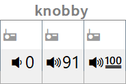

## Usage

- Install [AutoHotkey](https://github.com/Lexikos/AutoHotkey_L/releases)
- Install [nircmd](http://www.nirsoft.net/utils/nircmd.html)
- Run `knobby.ahk` by double-clicking

### Open on Windows 10 Startup

1. Open Task Scheduler
2. Click Task Scheduler Library in left sidebar, then Create Basic Task in right sidebar
3. Name the task anything you want, then set the trigger to "When I log on" or "When the computer starts"
4. Select "Start a program" for "What action do want the task to perform?"
5. Choose `knobby.ahk` as the program by clicking the "Browse..." button in the "Program/script" selection

> NOTE: You will need AutoHotkey and knobby on your machine already before attempting to launch it on computer launch / user log in.

## License

See [LICENSE](LICENSE). Reach out on [🐦Twitter](https://twitter.com/insanj) or [🤖Github](https://github.com/insanj)!

## Authors
```
Julian Weiss
github.com/insanj
github@insanj.com
```
